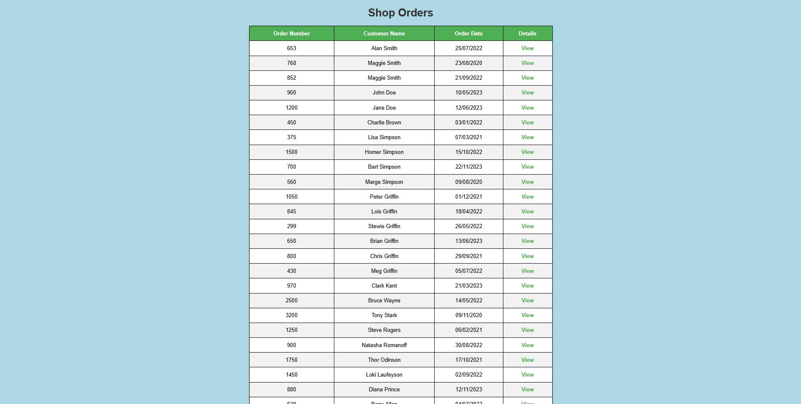
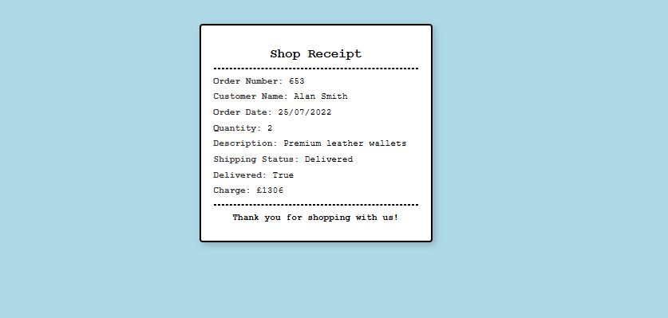

# Python Customer Orders

A funtion app that shows he Orders of Customers in a Table for the user. Using Jinja2 with Flask to render dynamically onto the page through the HTML templates.

- Python Version: 3.12.1
- Pip Version: 25.0
- Flask Version: 3.1.0

# How to start

* Install Python onto your machine.
* Install Flask
* Clone this repository.
* Navigate into the repository folder via your Termainal or IDE Terminal.
* Run ***python app.py***

# UI

Root page that is created

When View is clicked, it opens the Order page for the Receipt details

